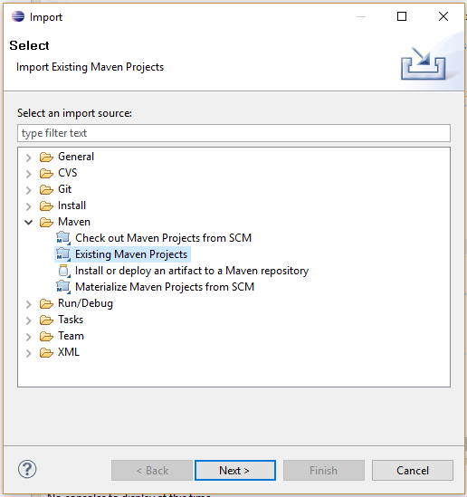
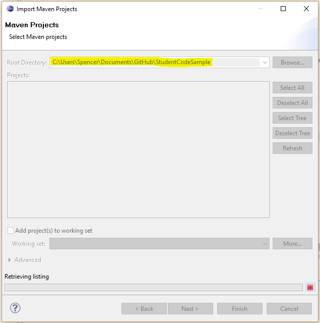
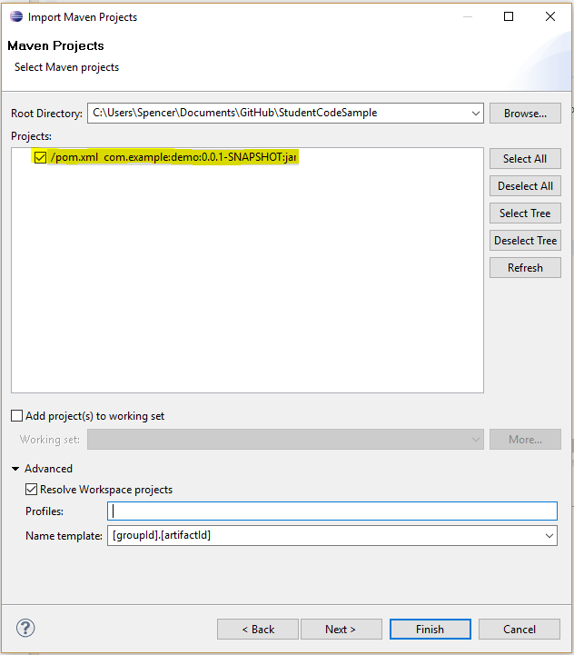
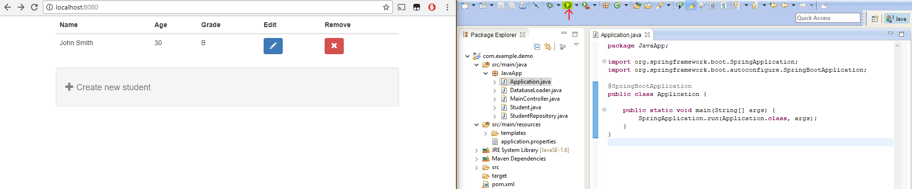
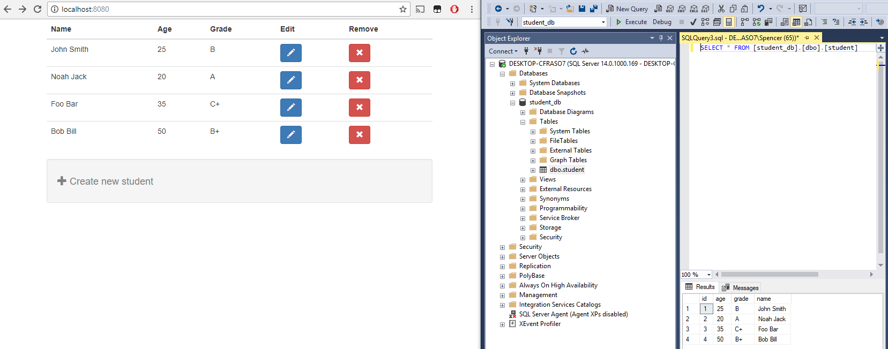
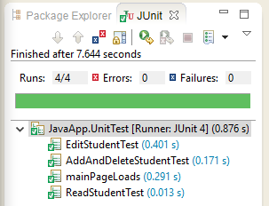
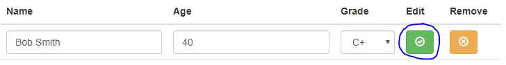
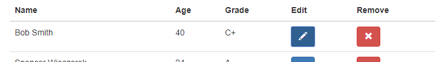

# Student Code Sample

This is a Sample Code Project to demonstrate a basic CRUD application with JavaScript [React](https://reactjs.org/) on the front-end and Java ([Spring](https://spring.io/)) on the back-end. This application was made to be cloned and easily executed without having to setup any additional dependencies (*ex: Node.JS*).

The following sections are covered in this README:

1. Setup and Running the Application
2. SQL Server DataBase Configuration
3. Running Unit Test
4. Application - Students CRUD

<h2>1. Setup and Running the Application</h2>

This example will be using an Eclipse IDE to walk-through loading and running this project, any other IDE with Maven support will also work.

**1.** Clone or download this repository:

<code>git clone https://github.com/SpencerWie/StudentCodeSample</code>
 

**2.** Select *`File --> Import...`*, then pick the option *`Maven --> Existing Maven Projects`*. Click *Next*.

**3.** Browse to the root directory that this repository was cloned to:

**4.** If needed resolve the name template, and then check the `pom.xml` file. Click *Finnish*.

**5.** Once the project loads into the Editor simply run the Application. Then open a web broswer and input the URL `http://localhost:8080/` (*Or the port initiated by Tomcat*). 

<h2>2. SQL Server DataBase Configuration</h2>

This application will automiacally create and H2 Database when executed, that way no inital Database setup is needed. Setting up a Database with SQL Server is simple, uncomment the pre-defined items in the `application.properties`. These settings are the ones by the developer for their SQL Server Database:

>spring.jpa.hibernate.ddl-auto = *create-drop* 
>spring.datasource.driverClassName=com.microsoft.sqlserver.jdbc.SQLServerDriver
>spring.datasource.url=jdbc:sqlserver://localhost;DatabaseName=**student_db**;integratedSecurity=false;
>spring.datasource.username=**sa**  
>spring.datasource.password=**password**  

In the settings above replace `student_db` with the name of your database, then change the username `sa` and password `password` to a user which has access do that database. The option `create-drop` can also be changed if needed.

Below is an example of the application and Database with the settings above:

<h2>3. Running Unit Test</h2>

To run unit test using JUnit go to the file *src/main/UnitTest.java*, when opened the green execute button should contain the tooltip *Run UnitTest*. Now click run and Ecplise will run the unit test and give back passing results:

 
<h2>4. Application -Students CRUD</h2>

<h4>Creating a New Student</h4>

Click the item below the table called *"+ Create new student"*, then fillout the form information and click *"Create"*:

The new student will appear at the bottom of the list automatically, and the form will be set back to it's default values. There are basic HTML5 validations to prevent blank fields.

<h4>Editing a Student</h4>

Clicking the button with a pencil icon in any row will toggle that row to be editable. The buttons change to confirm edit and cancel edit buttons and repectively have tooltips *"Confirm Edit"* and *"Cancel Edit"*. 

If we give a blank value for *Name* and change Grade to *B+* then click on *Confirm Edit* a red border is shown on the blank field indicating the valid is invalid:

Then clicking on *Cancel Edit* changes that row back to it's default view, and no changes are made. If we click on *Edit* on the row for "John Smith" and change the values to "Bob Smith", "40", and "C+" respectively and click *Confirm Edit* the view updates to those new values:

 <h4>Deleting a Student</h4>
 
 To delete a student click on the red button with an "X" symbol on the very right of the row. This will delete that record and refresh the table after a confirmation dialog:
 

